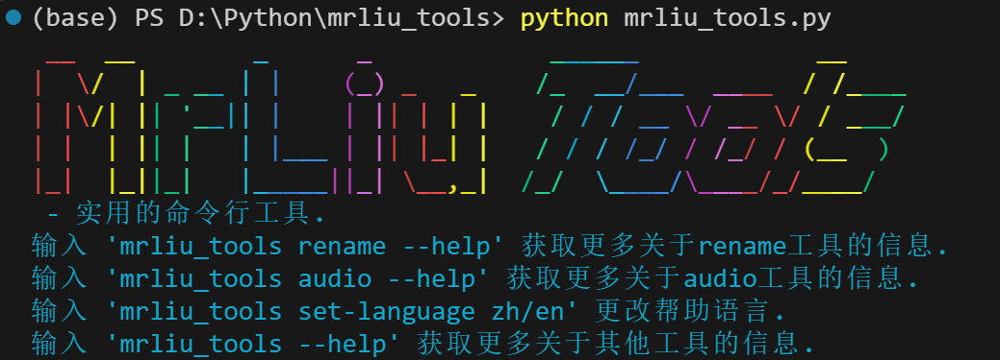
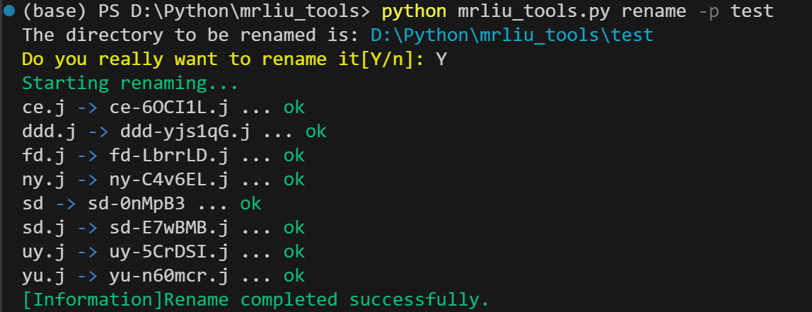

# mrliu_tools
 文档语言:
 中文 
 [英文(暂无)](README.md)

# 简介
 ### mrliu_tools是基于python的click库实现的终端工具
 ### 本项目会持续更新, 尽情期待...

# 使用方法
 > ### click是一个 Python 库, 用于以可组合的方式创建优雅的命令行工具接口

 在mrliu_tools中, 我使用click库制作了一些工具, 下面是它的用法:

 ### 在终端中:

 

 ### 运行`rename_tool`：
 

 > #### 注意:在实际使用中, 可能未编译, 使用`python mrliu_tools.py`即可

---

# 历史更新版本
## version 1.3.2
 在这个版本中, 未添加新的工具, 但进行了些优化:
 1. 修复了`rename`中文件缺失造成WinError的问题
 2. 修复了一些bug

## version 1.3.1
 在这个版本中, 未添加新的工具, 但进行了些优化:
 1. 修改了`mrliu_tools.py`的结构, 合并`audio-send`和`audio-recv`为`audio`.
 2. 优化了在不使用其中一种工具时, 强制安装此工具的库的问题, 只有在使用该工具时才安装所需的库.
 3. 修复了一些bug.

## version 1.3.0
 在这个版本中, 添加了`set-language`:
 1. 添加`set-language`, 现在可以更改`--help`的语言了.
 1. 添加了`resource.py`, 用于存储必要的资源.
 2. 为`audio_recv`添加了队列异步收包+回调取数据, 减少卡顿.

## version 1.2.0
 在这个版本中, 添加了`audio_tool.py`, 其中包含`audio_send`和`audio_recv`:
 1. 添加`audio-send`和`audio-recv`, 可以通过局域网传输音频.
 2. 优化`mrliu_tools.py`的结构.

## version 1.1.1
 在这个版本中, 未添加新的工具, 但进行了些优化:
 1. 为`rename`添加了更多关键字, 包括:
 ```
  ?md5; - 获取文件的md5值.
  ?parent; - 获取父文件名.
  ?rand=<N>; - 生成N位随机字符串.
  ?user; - 当前操作系统用户名.
  ?upper;/?lower; - 文件名转大写或小写.
  ...
 ```

## version 1.1.0
 在这个版本中, 更改项目名为`mrliu_tools`:
 1. 将`rename_tool.py`更改为`mrliu_tools.py`, 准备添加更多工具.
 2. 优化代码结构, 现在使用`mrliu_tools rename`而不是`rename_tool`.
 3. 修复了一些bug.

## version 1.0.0
 在这个版本中, 此项目正式确定, 名称为`rename_tool`:
 1. 添加了`rename_tool.py`, 可用于批量更改名字.
 2. 最初的版本就做了这么点...QWQ

